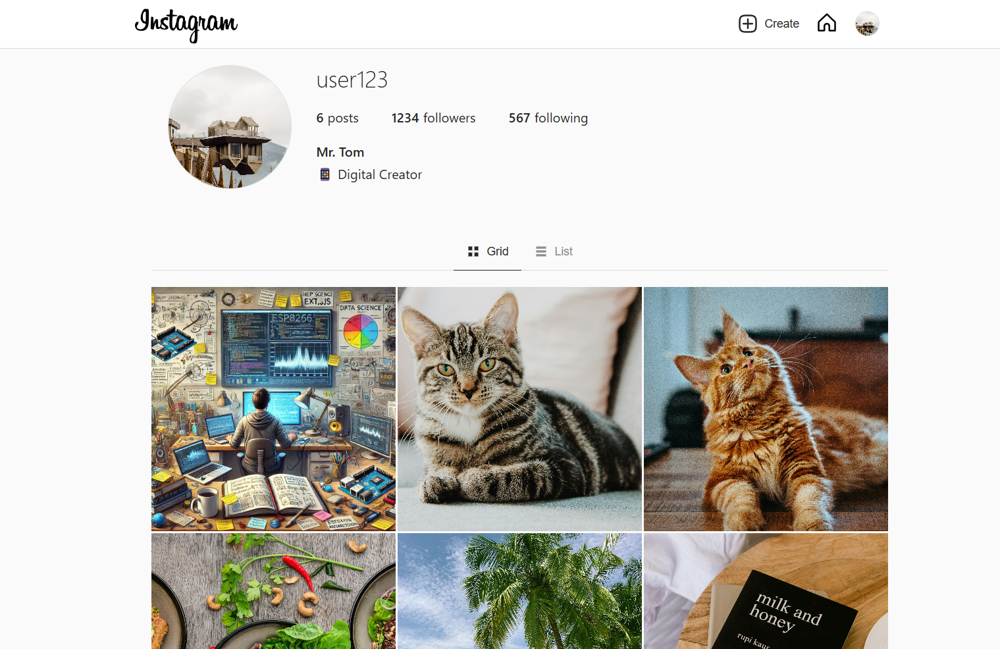
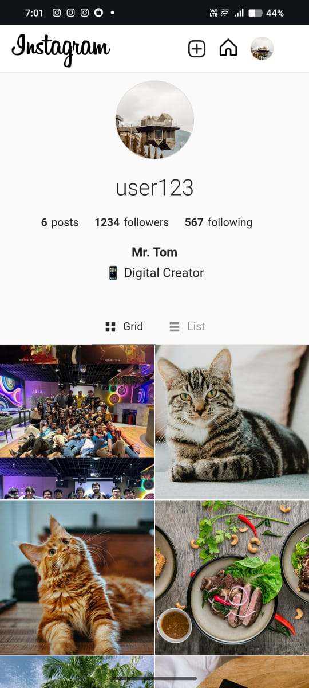

# Instagram Clone

## Project Overview

This is a full-stack Instagram clone web application built using Next.js, React, and Tailwind CSS. The application provides a feature-rich Instagram-like experience with responsive design, post creation, and interactive feed functionality.

## Technologies Used

- **Frontend Framework**: Next.js 15.2.0
- **State Management**: Zustand
- **Styling**: Tailwind CSS
- **Image Handling**: react-image-crop
- **Language**: TypeScript

## Demo

### Desktop Preview


### Mobile Preview


## Features

### Feed Page
- Responsive display of user posts
- Infinite scrolling feed
- Real-time post updates

### Post Creation Flow
- Multiple image upload methods:
  - Paste URL
  - Upload from device
  - Take photo from camera
- Advanced image cropping
  - Multiple aspect ratio options
  - Edit crop functionality
- Caption input with emoji picker

### Profile Section
- Dynamic post count tracking
- Two view modes:
  - Grid view
  - List view
- Hover interactions in grid view
  - Display likes and comments count
- Modal view for individual posts
  - Image on left
  - Interactions on right

### Feed Interactions
- Like/Unlike posts
  - Double-click to like (Instagram-like interaction)
- Commenting system
  - Emoji picker for comments
  - Comment threading (reply to comments)
- Timestamp display
  - Post upload time
  - Comment timestamps
- Share options
  - Copy link
  - WhatsApp sharing
  - Facebook sharing
- Post deletion functionality

### Technical Highlights
- Fully responsive design
- Loading animations
- Browser history navigation support

## Prerequisites

- Node.js (v18 or later recommended)
- npm or yarn

## Local Setup

1. Clone the repository:
```bash
git clone https://github.com/Shivang004/Instagram-Clone.git
cd Instagram-Clone/instagram-clone
```

2. Install dependencies:
```bash
npm install
# or
yarn install
```

3. Run the development server:
```bash
npm run dev
# or
yarn dev
```

4. Open [http://localhost:3000](http://localhost:3000) in your browser

## Environment Variables

No specific environment variables are required for local setup.

## Deployment

The project is deployed on Vercel and can be accessed at: [https://instagram-clone-sbfe.vercel.app/](https://instagram-clone-sbfe.vercel.app/)

## Responsive Design

The application supports:
- Desktop Web View (standard browser)
- Mobile Web View (smaller screen optimization)
